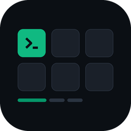

<p align="center">
  
</p>

<h1 align="center">Stream Deck Agent Cockpit</h1>

<p align="center">
  Claude Code, Codex, Pi, JCode를 비롯한 모든 터미널 에이전트를 위한 하드웨어 컨트롤.<br>
  독립 실행, 로컬 전용, 그리고 근거에 기반한 상태 표시.
</p>

<p align="center">
  <a href="https://cskwork.github.io/streamdeck-agent-cockpit/?lang=ko"><strong>랜딩 페이지</strong></a> ·
  <a href="INSTALL.md"><strong>설치</strong></a> ·
  <a href="skills/streamdeck-agent-cockpit/SKILL.md"><strong>SKILL.md</strong></a> ·
  <a href="CHANGELOG.md"><strong>변경 내역</strong></a>
</p>

<p align="center">
  
  
  
  
</p>

<p align="center">
  <a href="README.md">English</a> · <strong>한국어</strong>
</p>

---

Stream Deck을 Claude Code, Codex, Pi, JCode 등 터미널 기반 에이전트를 위한 로컬 콕핏으로 바꾸는 단일 이식형 스킬이자 레퍼런스 런타임입니다.

**MCP 서버가 필요하지 않습니다.** 기본 구현은 루프백 전용 Python 데몬, 사전 선언된 로컬 명령, 그리고 생성된 런처 또는 Stream Deck SDK 플러그인만 사용합니다.

## 빠른 설치

```bash
claude plugin marketplace add cskwork/streamdeck-agent-cockpit
claude plugin install streamdeck-agent-cockpit@streamdeck-agent-cockpit
```

Codex, Gemini CLI, Cursor, OpenCode, Amp, Antigravity 및 수동 설치 방법은 모두
[INSTALL.md](INSTALL.md)에 있습니다.

## 무엇이 독립 실행인가

```text
┌──────────────────────────────────────────────────────────────┐
│ Stream Deck                                                  │
│  A. 내장 Open 액션 → 생성된 런처                             │
│  B. 로컬 Agent Cockpit 플러그인 → 동적 키/다이얼 UI          │
└───────────────────────┬──────────────────────────────────────┘
                        │ 인증된 localhost API
┌───────────────────────▼──────────────────────────────────────┐
│ cockpitd                                                     │
│  설정 · 명령 허용목록 · 상태 TTL · 어댑터 레지스트리         │
└───────────────────────┬──────────────────────────────────────┘
                        │ argv 실행, 원격 MCP 사용 없음
┌───────────────────────▼──────────────────────────────────────┐
│ tmux / 터미널 / 에이전트 CLI                                 │
│  Claude Code · Codex · Pi · JCode · 사용자 정의 명령         │
└──────────────────────────────────────────────────────────────┘
```

`streamdeck-mcp`와 AgentDeck은 이 런타임에서 설치되지도, import 되지도, 호출되지도, 전제되지도 않습니다. 선행 사례로 참고할 수는 있지만 이 스킬의 동작은 그것들에 의존하지 않습니다.

## 모드

| 모드 | 요구 사항 | 적합한 경우 | 한계 |
|---|---|---|---|
| 런처 전용 | Stream Deck 앱, Python 3.9+, 설정된 터미널 도구 | 정적인 탭-실행/포커스 액션 | 라벨/아이콘 실시간 갱신 및 다이얼 이벤트 불가 |
| 네이티브 플러그인 | 위 항목 + 현행 공식 Stream Deck SDK 툴체인 | 실시간 상태, 동적 비주얼, 홀드, 다이얼, Property Inspector | 로컬 플러그인 빌드·설치 필요 |

데몬과 CLI는 Python 표준 라이브러리만 사용합니다.

## 저장소 구조

```text
streamdeck-agent-cockpit/
├── README.md · INSTALL.md · CHANGELOG.md · LICENSE · VERSION
├── .claude-plugin/          # Claude Code 플러그인 + 마켓플레이스 매니페스트
├── .codex-plugin/           # Codex 플러그인 매니페스트
├── .agents/plugins/         # agents 마켓플레이스 매니페스트
├── .cursor/skills/…         # SKILL.md의 Cursor 미러
├── gemini-extension.json    # Gemini CLI 확장 (컨텍스트: GEMINI.md)
├── docs/index.html          # 랜딩 페이지 (GitHub Pages)
└── skills/streamdeck-agent-cockpit/
    ├── SKILL.md
    ├── assets/
    │   ├── cockpit.example.json
    │   ├── cockpit.live-sessions.example.json
    │   └── cockpit.schema.json
    ├── bin/
    │   ├── cockpitd.py
    │   ├── cockpitctl.py
    │   ├── focus_tmux.py
    │   ├── report_state.py
    │   ├── slotclaims.py            # 붙잡은 세션의 슬롯 관리
    │   ├── claim_probe.py           # 슬롯 점유 여부 probe
    │   ├── focus_terminal.py        # tty로 iTerm2 / 터미널 포커스
    │   ├── claude_hook.py           # Claude Code 훅 → 의미 상태
    │   └── install_claude_hooks.py  # 훅 등록 (추가 전용)
    ├── scripts/
    │   ├── generate_launchers.py
    │   ├── install_runtime.py
    │   ├── install_skill.py
    │   ├── probe_environment.py
    │   ├── smoke_test.py
    │   └── validate_cockpit.py
    ├── templates/streamdeck-plugin/
    ├── references/
    ├── evals/
    └── tests/
```

아래에서 `python3 scripts/…`로 시작하는 모든 명령은 `skills/streamdeck-agent-cockpit/`에서 실행합니다.

## 스킬 수동 설치

플러그인 매니저를 통한 설치(Claude Code, Codex, Gemini CLI, `npx skills`, agy)는
[INSTALL.md](INSTALL.md)를 참고하세요. 스킬을 직접 스킬 디렉터리로 복사하려면:

```bash
cd skills/streamdeck-agent-cockpit

# 지원되는 모든 위치 미리보기
python3 scripts/install_skill.py --target all --dry-run

# 설치
python3 scripts/install_skill.py --target all
```

지원되는 타깃:

| 타깃 | 대상 경로 |
|---|---|
| `claude` | `~/.claude/skills/streamdeck-agent-cockpit` |
| `agents` | `~/.agents/skills/streamdeck-agent-cockpit` |
| `jcode` | 기본값 `~/.jcode/skills/streamdeck-agent-cockpit`; 설치된 빌드가 다른 탐색 경로를 쓴다면 `--destination`으로 재지정 |
| `all` | 위의 모든 고유 경로 |

다른 탐색 디렉터리를 사용하는 하네스라면 `--destination /verified/local/skills/path`를 사용하세요. 편집 가능한 개발용 설치는 `--mode symlink`를 사용합니다. 이미 존재하는 대상 경로는 `--force` 없이는 거부되며, 강제 교체 시 먼저 타임스탬프가 붙은 백업을 만듭니다.

## 로컬 런타임 설치

```bash
cd skills/streamdeck-agent-cockpit
python3 scripts/probe_environment.py --json   # 무엇이든 가정하기 전에 먼저 확인
python3 scripts/install_runtime.py
```

다음이 생성됩니다:

```text
~/.agent-cockpit/
├── bin/
├── cockpit.json
├── state.json       # 필요 시 생성
└── token            # 데몬이 mode 0600으로 생성
```

설치 스크립트는 시작 프로그램 서비스를 등록하거나 Stream Deck 프로필을 수정하지 않습니다.

## 세션과 컨트롤 설정

`~/.agent-cockpit/cockpit.json`을 편집합니다. 포함된 예제는 에이전트별로 이름 붙은 `tmux` 세션을 하나씩 정의합니다:

- `session.claude.main`
- `session.codex.main`
- `session.pi.main`
- `session.jcode.main`

해당 머신에 실제로 설치된 명령 이름과 플래그를 확인하세요:

```bash
claude --help
codex --help
pi --help
jcode --help
```

그다음 검증합니다:

```bash
python3 ~/.agent-cockpit/bin/validate_cockpit.py \
  ~/.agent-cockpit/cockpit.json
```

## 데몬 시작과 점검

```bash
python3 ~/.agent-cockpit/bin/cockpitd.py \
  --config ~/.agent-cockpit/cockpit.json
```

다른 터미널에서:

```bash
python3 ~/.agent-cockpit/bin/cockpitctl.py \
  --config ~/.agent-cockpit/cockpit.json health

python3 ~/.agent-cockpit/bin/cockpitctl.py \
  --config ~/.agent-cockpit/cockpit.json controls
```

설정된 탭 동작 실행:

```bash
python3 ~/.agent-cockpit/bin/cockpitctl.py \
  --config ~/.agent-cockpit/cockpit.json \
  invoke session.claude.main --gesture tap
```

홀드로 확인하는 인터럽트는 명시적으로 지정합니다:

```bash
python3 ~/.agent-cockpit/bin/cockpitctl.py \
  --config ~/.agent-cockpit/cockpit.json \
  invoke session.claude.main --gesture longPress --confirm
```

## 런처 전용 설정

플랫폼별 런처를 생성합니다:

```bash
python3 ~/.agent-cockpit/bin/generate_launchers.py \
  --config ~/.agent-cockpit/cockpit.json \
  --output ~/.agent-cockpit/launchers
```

Stream Deck 애플리케이션에서 내장 **Open** 액션을 배치하고 원하는 컨트롤의 런처를 선택하세요. 이 경로는 완전히 독립적이며 플러그인을 컴파일하지 않습니다. 탭 액션만 지원합니다.

## 동적 플러그인 설정

현행 공식 Stream Deck SDK로 로컬 플러그인 스캐폴드를 생성하세요. 그다음 [`skills/streamdeck-agent-cockpit/templates/streamdeck-plugin/`](skills/streamdeck-agent-cockpit/templates/streamdeck-plugin/)의 파일을 해당 README의 설명대로 적용합니다. 각 액션 인스턴스는 논리적 `controlId`만 저장하고, 상태 조회와 실행은 로컬 데몬에 요청합니다.

플러그인은 Stream Deck의 내부 프로필 데이터베이스를 읽거나 다시 쓰지 않아야 합니다. 사용자가 액션을 직접 배치하거나, 이 플러그인이 소유한 선택적 프로필을 설치합니다.

또한 임의의 서드파티 플러그인 액션을 일반적인 방법으로 조회하거나 호출할 수 없습니다. 그런 액션은 Stream Deck에서 수동으로 조합하거나, 해당 서비스/플러그인이 문서화된 로컬 API를 제공할 때만 그 API를 통해 연결하세요.

## 정직한 진행 상태 보고

인프라는 tmux 세션이 존재한다는 사실은 검증할 수 있지만, 그것이 에이전트가 실행 중인지, 대기 중인지, 막혀 있는지, 끝났는지를 증명하지는 않습니다. 이벤트 소스가 없으면 UI는 개략 상태만 표시합니다.

에이전트 훅이나 워크플로가 의미론적 상태를 보고할 수 있습니다:

```bash
python3 ~/.agent-cockpit/bin/report_state.py \
  --config ~/.agent-cockpit/cockpit.json \
  --session session.codex.main \
  --state running \
  --label "Reviewing changes" \
  --ttl 180
```

이후:

```bash
python3 ~/.agent-cockpit/bin/report_state.py \
  --config ~/.agent-cockpit/cockpit.json \
  --session session.codex.main \
  --state needs_attention \
  --label "Approval required" \
  --ttl 600
```

보고가 만료되면 데몬은 개략적인 어댑터 상태로 되돌아갑니다. 백분율은 실제 워크플로가 명시적으로 보고했을 때만 허용됩니다.

## 이미 열어둔 세션 붙이기

위 내용은 코크핏이 직접 띄운 세션 이야기입니다. 하지만 실제 작업은 대개 이미 열어둔 터미널 탭에서 돌아가고 있죠. 그 세션들도 tmux로 옮기지 않고 실시간 상태와 함께 덱에 올릴 수 있습니다.

데몬은 `cockpit.json`에 선언되지 않은 세션의 보고를 거부합니다. 즉 실행 중인 세션이 스스로 등록할 수는 없습니다. 대신 **슬롯**을 미리 정해두고, Claude Code 훅이 살아있는 세션을 슬롯에 배정합니다. 슬롯 4개와 tmux 실행 컨트롤 1개를 묶어둔 [`cockpit.live-sessions.example.json`](skills/streamdeck-agent-cockpit/assets/cockpit.live-sessions.example.json)에서 시작하세요.

```bash
cp skills/streamdeck-agent-cockpit/assets/cockpit.live-sessions.example.json \
   ~/.agent-cockpit/cockpit.json
python3 ~/.agent-cockpit/bin/validate_cockpit.py ~/.agent-cockpit/cockpit.json
```

훅 브리지를 등록합니다. 추가 전용이고, 여러 번 실행해도 안전하며, 미리 볼 수 있습니다.

```bash
python3 ~/.agent-cockpit/bin/install_claude_hooks.py --dry-run
python3 ~/.agent-cockpit/bin/install_claude_hooks.py
```

첫 쓰기 전에 설정 파일을 백업해 두세요. 상태는 오직 훅 이벤트에서만 나옵니다.

| 훅 이벤트 | 키 표시 |
|---|---|
| `SessionStart`, `Stop` | `IDLE` |
| `UserPromptSubmit` | `RUN` |
| `Notification` (승인·대기·입력 요청) | `CHECK` |
| `SessionEnd` | 슬롯 해제, 키는 `OFF`로 |

키 라벨에는 세션의 작업 디렉터리 이름만 들어갑니다. 프롬프트 내용이나 모델 출력은 절대 올라가지 않습니다.

슬롯을 탭하면 해당 창이 앞으로 나옵니다. `focus_terminal.py`가 iTerm2와 macOS 터미널을 지원하며, 슬롯을 점유할 때 기록해 둔 tty로 창을 찾습니다.

이 방식의 한계는 모두 의도된 것입니다.

- **브리지를 설치하기 전부터 돌던 세션은 보이지 않습니다.** 해당 세션을 재시작해야 잡힙니다.
- **슬롯 수는 정해져 있습니다.** 전부 사용 중이면 새 세션은 무시됩니다. 기존 세션을 밀어내지 않습니다.
- **붙잡은 슬롯에는 interrupt 제스처가 없습니다.** 터미널 자동화로 `Ctrl-C`를 안전하게 보낼 방법이 없어서, interrupt는 `tmux send-keys`가 정확히 동작하는 tmux 세션에만 둡니다.
- **macOS 전용입니다.** 기본 probe·포커스 헬퍼는 `ps` 조상 추적과 AppleScript에 의존합니다. 다른 플랫폼은 같은 어댑터에 자체 명령을 넣어야 합니다.
- **터미널 제목은 읽지 않습니다.** 쓸 만해 보이지만 "생각 중"과 "승인 대기 중"을 구분하지 못합니다.

## 검증

`skills/streamdeck-agent-cockpit/`에서:

```bash
python3 -m compileall -q bin scripts tests
python3 -m unittest discover -s tests -v
python3 scripts/validate_cockpit.py assets/cockpit.example.json
python3 scripts/validate_cockpit.py assets/cockpit.live-sessions.example.json
python3 scripts/smoke_test.py
```

물리적 장치의 동작은 여전히 Stream Deck 애플리케이션과 대상 터미널에서 직접 확인해야 합니다. [`skills/streamdeck-agent-cockpit/references/verification.md`](skills/streamdeck-agent-cockpit/references/verification.md)를 참고하세요.

## 의도적인 한계

- 런처 전용 모드는 실시간 상태를 표시하거나, 홀드를 구분하거나, 다이얼 입력을 처리할 수 없습니다.
- 레퍼런스 플러그인 템플릿은 현행 공식 SDK로 직접 적용·빌드해야 하며, 미리 빌드된 플러그인 바이너리는 포함되지 않습니다.
- 공식 플러그인 경계는 임의의 프로필을 편집하거나 관련 없는 서드파티 플러그인 액션을 제어할 안전한 범용 API를 제공하지 않습니다.
- 터미널 포커스 동작은 터미널마다 다르며 실제 장치에서 확인이 필요합니다.
- 훅/RPC/워크플로 보고가 없으면 세션 상태는 개략 수준에 머무릅니다.
- 붙잡은 세션은 정해진 수의 슬롯만 쓰고 interrupt 제스처가 없으며, 레퍼런스 훅 브리지는 Claude Code만, 기본 probe·포커스 헬퍼는 macOS만 지원합니다.

## 보안 경계

- 기본적으로 루프백에만 바인딩합니다.
- 무작위 토큰을 로컬 mode-0600 파일에 저장합니다.
- 원시 명령 실행 엔드포인트가 없습니다.
- 명령은 argv 배열이며 `shell=False`로 실행합니다.
- 향후 구현이 검토된 마스킹 경로를 의도적으로 추가하지 않는 한 명령 출력을 반환하지 않습니다.
- 예제의 인터럽트 액션은 홀드 확인을 요구합니다.
- 임의의 Stream Deck 프로필을 편집하지 않습니다.
- cockpit JSON, 런처, 버튼 설정, 아이콘, 로그 어디에도 자격 증명을 두지 않습니다.

## 제거

데몬을 중지하고, Stream Deck 애플리케이션에서 Agent Cockpit이 소유한 액션/프로필을 제거하고, 로컬 플러그인을 설치했다면 함께 제거한 뒤 다음을 삭제합니다:

```bash
rm -rf ~/.agent-cockpit
rm -rf ~/.claude/skills/streamdeck-agent-cockpit
rm -rf ~/.agents/skills/streamdeck-agent-cockpit
rm -rf ~/.jcode/skills/streamdeck-agent-cockpit
```

이 과정은 관련 없는 프로필이나 서드파티 액션을 제거하거나 변경하지 않습니다.
